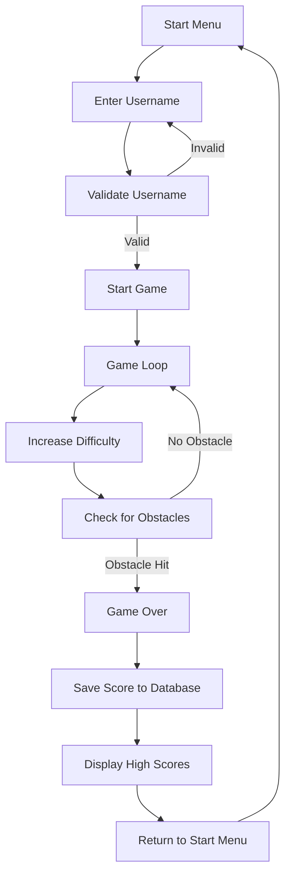

# Endless Runner Game

A fast-paced endless runner game developed using Pygame, inspired by the classic Dino game from Google Chrome. Players control a character that runs through an endless landscape, avoiding obstacles and competing for high scores.

## Game Flow
The diagram below illustrates the complete game flow:

## Key Features
- Score system based on distance traveled
- Progressive difficulty with increasing speed
- Username validation system
- High score storage using SQLite database
- High score display interface

## Requirements
- Python 3.x
- Pygame
- sqlite3

## How to Play
1. Execute the main game file
2. Enter your username (minimum 3 characters)
3. Use space bar to jump
4. Avoid obstacles to achieve the highest score possible